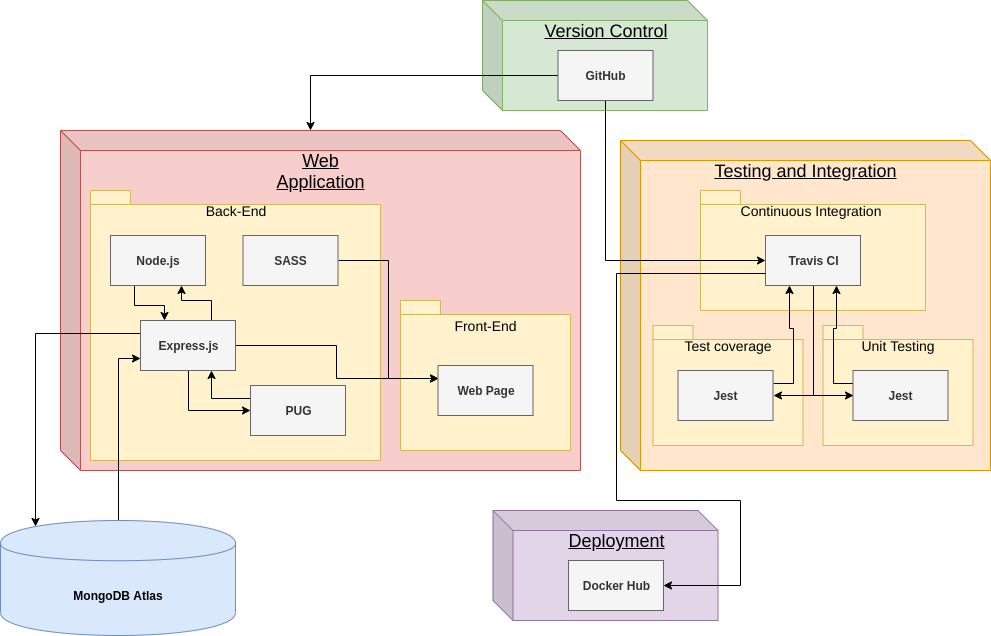
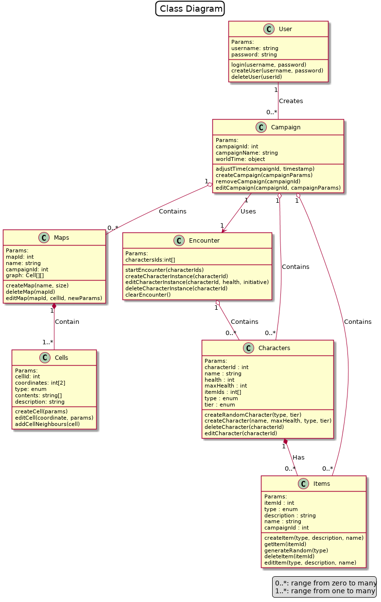
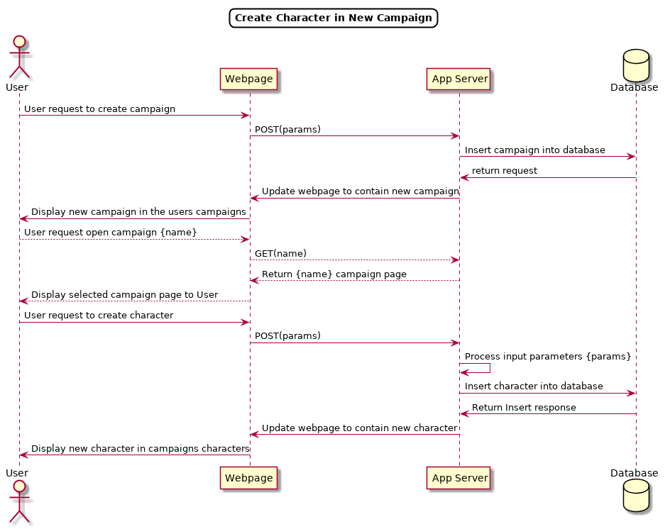

<!-- 

Title: Milestone 2 - Detailed Design
Authors: Ansh Shukla, Adam Hultman, Jonathan Parkes 
Class: SENG 350

-->

<!-- 
Marking Guide 
  
  technical writing is clear and concise (key decisions are documented; organization is easy to follow; basic English spelling and writing  conventions adhered to)

  design follows basic principles like cohesion/coupling, single responsibility, open/closed

  design addresses QAR from M1

  design provides path for implementing user stories in M1
  
  design models follow conventions for class and sequence diagrams

  design justifies technology choices
  
  ADRs (3+) explain why decision was taken, what the context is, and what alternatives were rejected

  ADRs don't capture trivial design decisions

Deliverables
  * PlantUML or JetUML class and behavior diagrams. This should explain the module structure and runtime/C&C structure of your app.
  * Design rationale, as Arch Decision Record

Details
   Describe, in <5 pages, how you intend to solve the problem and implement user stories and the ASRs from M1. Since we know this is a web app, assume the reader is familiar with basic app design and instead elaborate on how you will make the app conform to the ASRs (e.g., ensure performance is satisfied). 

   Include how you will continuously integrate and deploy the app and how you will test it
-->

<!-- Milestone 2  -->
<h1> M2  |  Detailed Design  </h1>

## Table of Contents

- [Introduction](#introduction)
- [Problem Definition](#problem-definition)
- [Target Users](#target-users)
- [Scope Changes](#scope-changes)
- [ASRs](#asrs)
    - [User Stories](#user-stories)
    - [Quality Attribute Requirements](#quality-attribute-requirements)
      - [Flexibility](#flexibility)
      - [Reusability](#reusability)
      - [Portability](#portability)
      - [Performance](#performance)
      - [Usability](#usability)
      - [Reliability](#reliability)
- [Our Solution](#our-solution)
  - [Class Diagram](#class-diagram)
  - [Sequence Diagram](#sequence-diagram)
  - [Components](#components)
      - [Component Diagram](#component-diagram)
      - [Backend](#backend)
        - [Node.js](#node.js)
        - [PUG](#pug)
        - [Sass](#sass)
        - [MongoDB Atlas](#mongodb-atlas)
      - [Continuous Integration](#continuous-integration)
      - [Testing](#testing)
- [Design Rationale](#design-rationale)
  - [Implement MVC Architecture Pattern](#adr-mvc)
  - [Use MongoDB Atlas as Database](#adr-mongo)
  - [Use Firebase as the NoSQL Solution](#adr-firebase)
  - [Use JEST for testing framework](#adr-jest)
  - [Use Travis CI for Continuous Integration](#adr-travis)
  - [Use Jenkins for Continuous Integration](#adr-jenkins)
  - [Organize Database Structure](#adr-db)
  - [Use PUG as view engine](#adr-pug)
  - [Use Sass for CSS preprocessing](#adr-sass)
---

<!-- Intro Section -->
## Introduction
[Dungeons & Dragons](https://dnd.wizards.com/) (D&D) is a table-top fantasy role-playing game (TTRPG) that is generally played with a group of 4-6 people. A “Game Master”, also known as a GM, leads a party of players through a set of adventures of their design or choosing called a “campaign”. In a campaign, the GM hosts 4-5 hour “sessions”. These are gatherings where all players and the GM of the campaign meet to play the game. All records of combat-tracking, world exploration, and everything in-between is usually managed manually on paper through multiple binders, books, and print-outs.

---
<!-- Problem Def Section -->
## Problem Definition
There are several online campaign management tools available on the internet that each provide unique features. However, these tools do not provide a centralized application for all the different aspects of the game, such as combat management, randomized treasure generation, and notes. Currently, GMs must utilize a combination of these tools to achieve their organizational objectives. This method can be considered an “encumbered system” as using it slows down the game and takes additional effort to manage all the different software tools while hosting a session. GMs require an unencumbered system to track the progression of their Dungeons & Dragons campaigns without the use of paper resources, which can be difficult to organize and access important information quickly, nor with several different software applications that must be switched between the different features they provide.

---
## Target Users
This application aims to benefit new and experienced GMs.

---
<!-- Scope Section -->
## Scope Changes
The initial scope for this web application was to also include players, apart from GMs, as a target audience by providing an interface for keeping track of their different characters. This was deemed to be too ambitious for our team size and timeline. Therefore, the player range of features was cut. Another factor that influenced the change of scope was our online survey targeted towards all players. The [survey results](https://drive.google.com/open?id=1mYAPcEABOVpvoClrvIgmlyZltIcWPpGi) indicated that the most popular features related to GM campaign management, not player specific features. This, in conjunction with the overly ambitious design, caused us to reduce the scope of our project and change our user stories.

---

<!-- ASRs Section -->
## ASRs

### User Stories
The majority of our user stories were related to player actions. Since these player features were cut, the user stories were redone to exclusively suit GMs and what they may want to do. These new stories include manipulating campaigns, items, and characters. They can be found in the project repository issues.

### Quality Attribute Requirements
When proposing the design of the MVC architecture with MongoDB for the web application, a priority was to ensure the satisfaction of our architecturally significant requirements (ASRs) in the form of our quality attribute requirements (QARs), such as flexibility, reusability, or portability. These different ASRs have been solved in a variety of ways by virtue of the design, as seen below.

#### Flexibility
Flexibility is important for the application since it aims to be compliant to an imagination-driven and continuously changing TTRPG. The benefit of the chosen design is that it will provide the ability to easily modify the application to fulfill additional requirements. This is a benefit that could be used towards potential features that are already planned as well as purposes that have not been planned for.

#### Reusability
The architecture achieves reusability in several ways. The decision to use [Sass](https://sass-lang.com/) to add variables and mix-ins allows us to reuse our code. Similarly, deciding to use a template renderer, like PUG, allows us to reuse templates and variables. Using MVC also helps reusability by separating the codebase into Model, Views, and Controllers. This means we can change and reusone one, without breaking the other.

Note: Another quality attribute scenarios (QAS) for reusability was directed towards players. This was remade for the context of GM usage. This new scenario can be found on the repository under issues.

#### Portability
Since the end user must be able to access the campaign’s information from a reasonable range of platforms, portability is key. Being a web app, it will be inherently available on a multitude of devices ( iOS/Android/Web) that can connect to the internet via a browser. Sass will help develop responsive design in the frontend to handle the range of device sizes.

#### Performance
Performance is important for both users and developers. While waiting for a process to finish, such as waiting for a query to finish. Using MongoDB Atlas as the database program allows for a performance increase relative to SQL databases due to its document-oriented design.

#### Reliability
Using the proposed MVC architecture would address the QAR of reliability in the way of robustness. An error in one portion of the system could be caught and would not have an adverse effect on the rest of the system, making it more reliable overall.

#### Maintainability
The architecture chosen supports maintainability in several ways. Unit testing via the chosen JEST framework allows us to ensure new code does not break previous code. JEST also works well alongside Travis CI to automatically test and deploy our code at every iteration. This helps maintainability by making sure our builds are still continuously passing.

Sass also provides maintainability. As the project grows and becomes more complex, standard CSS will become harder and harder to maintain and remain consistent. Sass provides better organization and readability which results in better maintainability.

Similarly, PUG allows allows for better organization and readability.

---
<!-- Solution Section -->
## Our Solution
In order to simplify a GM’s campaign management, a Dungeons & Dragons tracker web application will be developed. This application will allow GMs to input relevant information from their campaign and have it organized and stored on servers for both continuous and later use. This solution enables GMs to limit the dependency on paper based solutions and to reduce dependency on multiple different software applications. In addition to reducing the encumbrance of campaign management, this application will assist with real time decisions that would otherwise have to be determined manually, ultimately slowing down the game.

<!-- Components Section -->
### Components

The main components used for this solution consist of both pre-determined project requirements and a few chosen ones. As seen below, the latter were chosen to satisfy the QARs. Below is the component diagram that shows the relations between the main components in the system.

#### Component Diagram

  

#### Backend
#### Node.js
Node.js is used as the backend runtime environment to execute transpiled TypeScript code which utilizes the express application framework. Since Node.js compiles javascript directly into machine code, allows non-blocking I/O systems to process several requests concurrently, and allows for caching, it will help the application to meet performance QAR goals.

#### PUG
PUG was chosen as the template engine to assist in the development process by making it easier to make and edit HTML files, which satisfies the QAR of usability. See the [ADR](link-to-relevant-adr) for details on our decision.

#### Sass
Sass was chosen to assemble CSS with variables and mixins. These variables satisfy two QARs: maintainability and flexibility. It achieves maintainability by allowing simplified organization and change of styles throughout a SCSS file.The mixins allow for reuse of CSS across the whole web application, this adheres to the QAR of reusability. See the [ADR](link-to-relevant-adr) for decision details.

#### MongoDB Atlas
MongoDB Atlas was chosen as the database. This further contributes to the performance QAR by offering a quicker document-oriented database design, rather than relational. See the [ADR](link-to-relevant-adr) for details. 

### Continuous Integration
[Travis CI](https://travis-ci.org/) is used as the continuous integration tool. Travis CI automatically builds, tests, and deploys the code as per the configurations. The configuration will define the environment, such as language and node version, and the installation instructions. Travis CI can also include services, such as running and building Docker images. This will be useful for when Docker is integrated into the project. The current integration flow would be, push code changes to the GitHub repo, GitHub will then trigger Travis CI to build based on the configurations, then Travis will run the unit tests, and then alert if the build failed or passed. When project development begins, Travis CI will deploy it, given that the build passed (presumably deploying a Docker container  to Docker Hub). 

### Testing
The chosen unit test framework is [JEST](https://jestjs.io/), which is an industry standard unit test framework that works with projects using several languages and frameworks, including TypeScript. JEST was chosen because it aims to work with minimal configurations and has its api very well documented. JEST also has integration into [WebStorm](https://www.jetbrains.com/webstorm/?fromMenu), the IDE that will be used, to run / debug tests and to view coverage reports right inside the IDE. This contributes to satisfying the QAR of usability by making it easier and quicker to develop and test. See the associated [ADR](#adr-travis) for details on this decision.

### Class Diagram

The below class diagram is able to show the different classes in the application as well as how they relate to each other. As seen in the class diagram, there are many different relationships that exist such as the 1 → 0..* and 1 → 1..* relations. To define these relations, 1 → 0..* means there is either a one to zero, one to one, or one to many relations. Similarly, the 1 → 1..* relation is either ‘one to one’ or ‘one to many’. These are important relations as they are directly decided by the architectural decisions and quality attribute scenarios (QAS) that have been created. For example, the relation between campaign and maps uses a 1 → 0..* relation. This is because it had been decided that there will be no maps to start with, but the user is able to create as many maps as they want. 

  

## Sequence Diagram
The following sequence diagram helps to show the behaviour of the application for a set of tasks based on the user's actions. The set of tasks displayed in the sequence diagram cover two of the solution's user stories: creating a new campaign and creating a new character. For this process, it is assumed that the user has previously been logged in to the web application. To achieve the specified tasks, a user sends a request (by interacting with the UI) that then processes through the application moving from the web page, to the application server, and then to the database and back.

  

---

## Design Rationale 

<table id='adr-mvc'>
  <th colspan='2'>ADR 1 : Implement MVC Architecture Pattern</th>
  <tr>
    <th> Status </td>
    <td> Accepted </td>
  </tr>
  <tr>
    <th> Context </td>
    <td>
      Architecture patterns help solve common issues when it comes to organizing architecture. We need a way to structure our application in a way that makes it easier to develop, maintain, and test.
    </td>
  </tr>
  <tr>
    <th> Decision </td>
    <td> 
      Use MVC Architecture Pattern since it was discussed in the lab and it makes fits our project.
    </td>
  </tr>
  <tr>
    <th> Consequences</td>
    <td> 
      Positive: Makes parallelism with teamwork easy.
    </td>
  </tr>
<table>

 

<table id='adr-mongo'>
  <th colspan='2'>ADR 2 : Use MongoDB Atlas as Database</th>
  <tr>
    <th> Status </td>
    <td> Accepted </td>
  </tr>
  <tr>
    <th> Context </td>
    <td>
      Creating a database using just MongoDB while developing proved problematic. Each team member would either have to replicate the database onto their own system to develop the code, or we would have to host it on a computer / cloud and worry about how to manage that. Would we always keep that one computer running to connect to, how would we manage firewalls, or would we host it on the cloud and choose a cloud infrastructure. This is where MongoDB Atlas comes in. MongoDB Atlas is a cloud database as a service managed by MongoDB.
    </td>
  </tr>
  <tr>
    <th> Decision </td>
    <td> 
      We will use MongoDB Atlas because it would manage hosting, managing, and securing the database, whereas we would only worry about the actual data.
    </td>
  </tr>
  <tr>
    <th> Consequences</td>
    <td> 
      We will have to conform to MongoDB Atlas’s limitations  (500mb max for free tier) 
    </td>
  </tr>
<table>

 

<table id='adr-firebase'>
  <th colspan='2'>ADR 3 : Use Firebase as the NoSQL Solution</th>
  <tr>
    <th> Status </td>
    <td> Rejected </td>
  </tr>
  <tr>
    <th> Context </td>
    <td>
      Firebase is Google’s solution to a NoSQL cloud database, this however provides no additional benefits to the application when compared to MongoDB.
    </td>
  </tr>
  <tr>
    <th> Decision </td>
    <td> Not to use Firebase instead of MongoDB </td>
  </tr>
  <tr>
    <th> Consequences</td>
    <td> 
      We will not have to change code from the lab to setup the database compared to learning how to setup Firebase.
    </td>
  </tr>
<table>

 

<table id='adr-jest'>
  <th colspan='2'>ADR 4 : Use JEST for testing framework</th>
  <tr>
    <th> Status </td>
    <td> Accepted </td>
  </tr>
  <tr>
    <th> Context </td>
    <td>
      We are required to do unit testing for our project, thus need a unit testing framework that works well for our project.
    </td>
  </tr>
  <tr>
    <th> Decision </td>
    <td> 
      We will use JEST for testing framework because it works with TypeScript, provides coverage reports, and is easy to use. 
    </td>
  </tr>
  <tr>
    <th> Consequences</td>
    <td> 
      Positives: Simple set-up, aids in reliability QAR, works well with WebStorm IDE.
       
      Negatives: May be slowwe on Docker CI than other unit testing frameworks.
    </td>
  </tr>
<table>

 

<table id='adr-travis'>
  <th colspan='2'>ADR 5 : Use Travis CI for Continuous Integration</th>
  <tr>
    <th> Status </td>
    <td> Accepted </td>
  </tr>
  <tr>
    <th> Context </td>
    <td>
      Continuous Integration helps maintain code and automates tasks such as unit testing and deploying. Travis CI was initially a project requirement, but became a suggestion among other options such as Jenkins. Jenkins was considered, but rejected due to the fact that we would have to host.
    </td>
  </tr>
  <tr>
    <th> Decision </td>
    <td> Chose Travis CI due to familiarity, configuration simplicity, and because it integrates well with GitHub. </td>
  </tr>
  <tr>
    <th> Consequences</td>
    <td> 
      Less customization options than Jenkins.
    </td>
  </tr>
<table>

 

<table id='adr-jenkins'>
  <th colspan='2'>ADR 6 : Use Jenkins for Continuous Integration</th>
  <tr>
    <th> Status </td>
    <td> Rejected </td>
  </tr>
  <tr>
    <th> Context </td>
    <td>
      Continuous Integration helps maintain code and automates tasks such as unit testing and deploying. Jenkins also allows for a lot of customization options.
    </td>
  </tr>
  <tr>
    <th> Decision </td>
    <td> 
      Not to use Jenkins for continuous integration as it requires it to be set up and hosted.
    </td>
  </tr>
  <tr>
    <th> Consequences</td>
    <td> 
      Not using jenkins means not having to setup a host for it to run on.
    </td>
  </tr>
<table>

 

<table id='adr-db'>
  <th colspan='2'>ADR 7 : Organize Database Structure</th>
  <tr>
    <th> Status </td>
    <td> Proposed </td>
  </tr>
  <tr>
    <th> Context </td>
    <td>
      We need a way to store items, characters, and maps in the database. 
    </td>
  </tr>
  <tr>
    <th> Decision </td>
    <td> 
      The decision was to link each item, character and map to a campaign via a unique campaign id.
    </td>
  </tr>
  <tr>
    <th> Consequences</td>
    <td> 
      Positives: Items, characters, and maps may be can be stored in the database so that the same item can exist in multiple campaigns.
       
      Negatives: More complex storage method.
    </td>
  </tr>
<table>

 

<table id='adr-pug'>
  <th colspan='2'>ADR 8 : Use PUG as view engine</th>
  <tr>
    <th> Status </td>
    <td> Accepted </td>
  </tr>
  <tr>
    <th> Context </td>
    <td>
      View template engines allow for us to process data and variables before producing HTML. Reusing data and code.
    </td>
  </tr>
  <tr>
    <th> Decision </td>
    <td> 
      Use PUG because it simplifies front-end development and maintainability. We also had experience with it through the lab.
    </td>
  </tr>
  <tr>
    <th> Consequences</td>
    <td> 
      Positives: Makes developing HTML pages quicker.
       
      Negatives: Learning to use this new tool.
    </td>
  </tr>
<table>

 

<table id='adr-sass'>
  <th colspan='2'>ADR 9 : Use Sass for CSS preprocessing
</th>
  <tr>
    <th> Status </td>
    <td> Proposed </td>
  </tr>
  <tr>
    <th> Context </td>
    <td>
      As the project gets bigger, CSS will get harder and harder to maintain.
    </td>
  </tr>
  <tr>
    <th> Decision </td>
    <td> 
      We will use Sass to introduce variables and other features to make it easier to reuse, read, and maintain our frontend code.
    </td>
  </tr>
  <tr>
    <th> Consequences</td>
    <td> 
      Positives: Simple set-up, aids in usability, flexibility, and reusability QARs, works well with WebStorm IDE.
       
      Negatives: There is a learning curve.
    </td>
  </tr>
<table>

